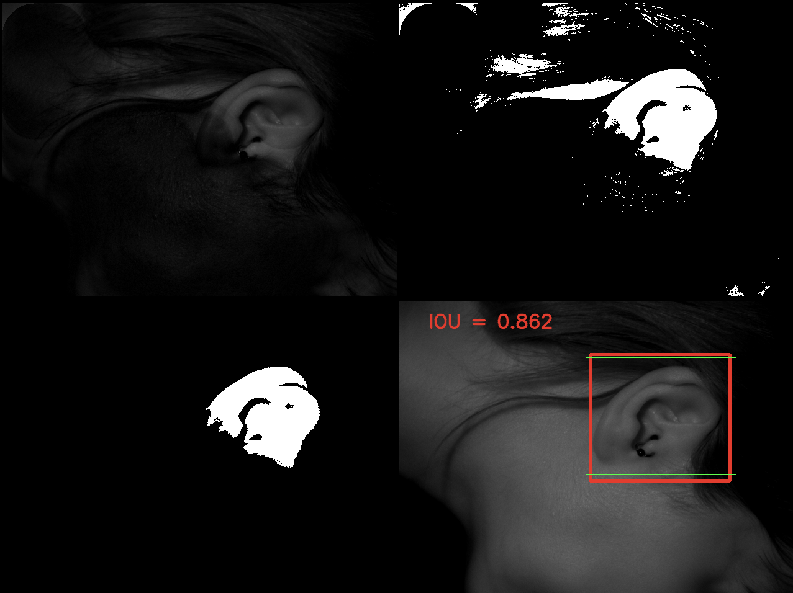

# Accurate segmentation of the ear image

The aim of this practice is to achieve an accurate segmentation of this feature. That is, as close to the ear region as possible without losing information from the facial region.

## Requirements

* Python 3.7+

* numpy == 1.21.3
* opencv_python == 4.5.3.56
* scipy == 1.7.1
* Shapely == 1.8.1.post1

How to install all the requirements :
```bash
$ pip install -r requirements.txt
```

## Usage of main.py

If you want to see the result of a specific image
```bash
$ python src/main.py --file=data/10.bmp
```

If you want to see the result of all images (located in data/ folder)
```bash
$ python src/main.py --file=all
```

You can also add the "show" parameter to see other results

Show can be equal to : "result", "confidence", "groundtruth", "detail"
```bash
$ python src/main.py --file=all --show=result
$ python src/main.py --file=all --show=confidence
$ python src/main.py --file=all --show=groundtruth
$ python src/main.py --file=all --show=detail
```

## Usage of groundtruth_generator.py

If you want to generate the JSON of a specific image (result saved in groundtruth/ folder)
```bash
$ python src/groundtruth_generator.py -f=data/10.bmp
```

If you want to generate the JSON of all images (located in data/ folder)
```bash
$ python groundtruth_generator.py -f=all
```

## Example

<p align="center">
  
</p>
<p align="center">
  <i>Example of the "detailed" output</i>
</p>

###### More explanations in ```docs/explanations_esp.pdf``` (only in spanish)

## Structure

    .
    ├── data
    │    └── *.bmp
    ├── docs
    │    └── explanations_esp.pdf
    ├── groundtruth
    │    └── *.json
    ├── imgs
    │    └── result.png
    ├── README.md
    ├── requirements.txt
    └── src
        ├── groundtruth_generator.py
        └── main.py


## Authors

* **Luis Rosario** - *Initial work* - [Luisrosario2604](https://github.com/Luisrosario2604)